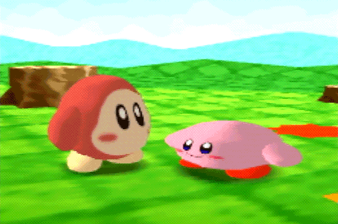
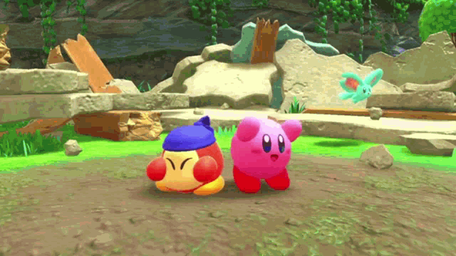

# hiya, i'm andy! 🤙

    → college student interested in full-stack / game development, product management, & cloud infrastructure ☺︎
     

 

    
    

## my recent game projects 📀

    → <a target="_blank" rel="noopener noreferrer" href="https://github.com/andy-jpeg/sasehacks_26">Space Buddies</a>, a 3D platformer about a team of little adorable space aliens exploring the galaxies and must make a pit stop to save a nearby planet from being destroyed by an evil organization!!
     
    → <a target="_blank" rel="noopener noreferrer" href="https://github.com/andy-jpeg/swamphacks_2025">A Ride That Never Ends</a>, a point-and-click turn-based JRPG about two investigators who are tracking down the disappearances in a local town and a mysterious train that only comes at midnight that may likely be connected..
     
    → <a target="_blank" rel="noopener noreferrer" href="https://github.com/andy-jpeg/knighthacks_2025">Thanatophobia</a>, an exploration game where you, a detective, trek through an abandoned asylum and start to notice that this place might be more connected to you than you thought..
     
    → <a target="_blank" rel="noopener noreferrer" href="https://github.com/andy-jpeg/osc_minihack25">The World Beyond Us</a>, a story game about a robot trying to find out its surroundings with an AI-powered environment assisting it throughout the game

## my languages & tools 🧑🏻‍💻

    

